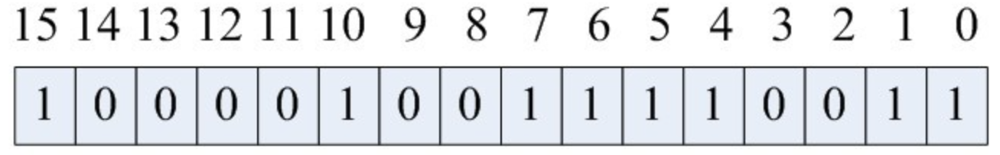
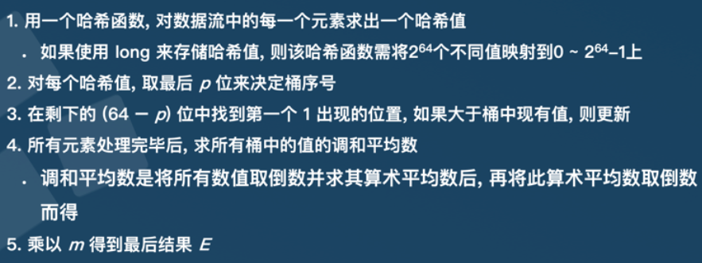
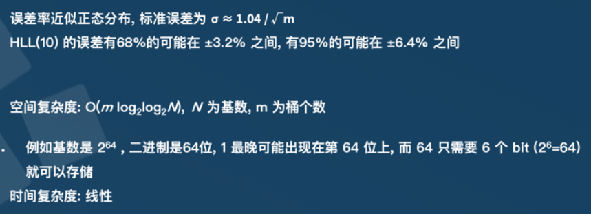

### [位图法](https://blog.csdn.net/yangquanhui1991/article/details/52172340)

 位图法就是bitmap的缩写。所谓bitmap，就是用每一位来存放某种状态，适用于大规模数据，但数据状态又不是很多的情况。通常是用来判断某个数据存不存在的。

**数据结构**

`unsigned int bit[N]`数组里面，可以存储 N * sizeof(int) * 8个数据，空间复杂度O(N)。

数据为{5，1，7，15，0，4，6，10}在位图中的存储如下:



**数据定位**

获取数据1234的存储位置:

```
字节位置： int nBytePos =1234/8 = 154;
位位置：  int nBitPos = 1234 & 7 = 2;
```

数据读写可通过<font color='cornflowerblue'>位运算</font>实现.

**位图法缺点**

```
1. 可读性差
2. 位图存储的元素个数虽然比一般做法多，但是存储的元素大小受限于存储空间的大小。位图存储性质：存储的元素个数等于元素的最大值。
3. 位图对有符号类型数据的存储，需要 2 位来表示一个有符号元素。这会让位图能存储的元素个数，元素值大小上限减半。
```

**位图法的应用**

1. 给40亿个不重复的unsigned int的整数，没排过序的，然后再给一个数，如何快速判断这个数是否在那40亿个数当中
   　将这40亿个数字存储到bitmap中，然后对于给出的数，判断是否在bitmap中即可。

2. 使用位图法判断整形数组是否存在重复
       遍历数组，放入bitmap，并且检查其是否在bitmap中出现过，如果没出现放入，否则即为重复的元素。
3. 使用位图法进行整形数组排序
        首先遍历数组，得到数组的最大最小值，然后根据这个最大最小值来缩小bitmap的范围。这里需要注意对于int的负数，都要转为unsigned int来处理，而且取位的时候，数字要减去最小值。
4. 在2.5亿个整数中找出不重复的整数，注，内存不足以容纳这2.5亿个整数
       参 考的一个方法是：采用2-Bitmap（每个数分配2bit，00表示不存在，01表示出现一次，10表示多次，11无意义）。其实，这里可以使用两个普 通的Bitmap，即第一个Bitmap存储的是整数是否出现，如果再次出现，则在第二个Bitmap中设置即可。这样的话，就可以使用简单的1- Bitmap了

### [布隆过滤器](https://www.cnblogs.com/liyulong1982/p/6013002.html)

bloom算法类似一个hash set，用来判断某个元素（key）是否在某个集合中。和一般的hash set不同的是，这个算法<font color='cornflowerblue'>无需存储key的值</font>，对于每个key，只需要k个比特位，每个存储一个标志，用来判断key是否在集合中。

**算法：**

```
1. 首先需要k个hash函数，每个函数可以把key散列成为1个整数
2. 初始化时，需要一个长度为n比特的数组，每个比特位初始化为0
3. 某个key加入集合时，用k个hash函数计算出k个散列值，并把数组中对应的比特位置为1
4. 判断某个key是否在集合时，用k个hash函数计算出k个散列值，并查询数组中对应的比特位，如果所有的比特位都是1，认为在集合中。
```

**优缺点**

优:

> 不需要存储key，节省空间;对保密要求非常严格的场合有优势
>
> 布隆过滤器存储空间和插入/查询时间都是常数
>
> 布隆过滤器可以表示全集，其它任何数据结构都不能；

缺:

> 随着存入的元素数量增加，误算率随之增加
>
> 无法删除([count bloom filter](https://cloud.tencent.com/developer/article/1136056))

**典型的应用场景：**
某些存储系统的设计中，会存在空查询缺陷：当查询一个不存在的key时，需要访问慢设备，导致效率低下。
比如一个前端页面的缓存系统，可能这样设计：先查询某个页面在本地是否存在，如果存在就直接返回，如果不存在，就从后端获取。但是当频繁从缓存系统查询一个页面时，缓存系统将会频繁请求后端，把压力导入后端。

这是只要增加一个bloom算法的服务，后端插入一个key时，在这个服务中设置一次.需要查询后端时，先判断key在后端是否存在，这样就能避免后端的压力。

### [HyperLogLog](https://blog.csdn.net/firenet1/article/details/77247649)

**原理**

HyperLogLog是基数算法,用于统计一个集合中不重复的元素个数.

> 算法通过1出现的最高位来估计不重复元素的个数.

[**算法**](https://cn.kyligence.io/blog/count-distinct-hyperloglog/)



**算法评估**



空间复杂度: O(m log2log2N), Ｎ 为基数, m 为桶个数。

> 有 2<sup>64</sup> 个的不重复元素，表达为二进制一个数是 64 位，这是第一重 log2,.
> 第一个1最晚可能出现在第 64 位。64 需要 6 个 bit (26=64) 就可以存储，这是第二重 log2。
> 如果精度为 10，则会有 1024 个桶，所以还要乘以桶的个数。

**应用场景**

只能统计基数数量，不知道具体的内容,一般用于大数据计数(小误差不影响).

```
统计注册 IP 数
统计每日访问 IP 数
统计页面实时 UV 数
统计在线用户数
统计用户每天搜索不同词条的个数
```

