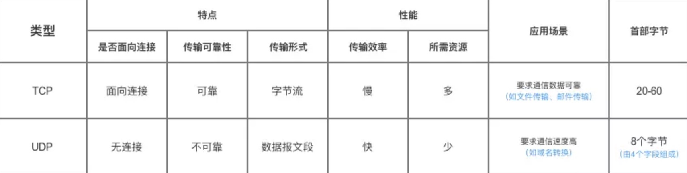
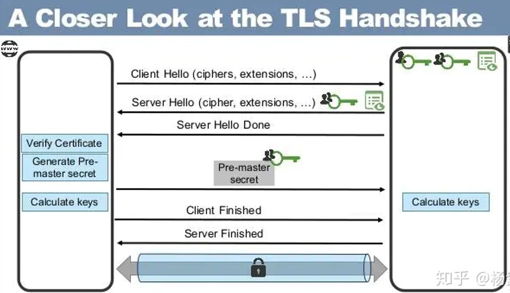

## 基础知识

### OSI与TCP/IP各层的结构与功能,都有哪些协议?


**应用层**
应用层的任务是通过应用进程间的交互来完成特定网络应用。应用层协议定义的是应用进程间的通信和交互的规则。对于不同的网络应用需要不同的应用层协议。在互联网中应用层协议很多，如域名系统DNS，支持万维网应用的 HTTP协议，支持电子邮件的 SMTP协议等等。

- 域名系统

> 域名系统(DNS)是因特网的一项核心服务，它作为可以将域名和IP地址相互映射的一个分布式数据库
>

- HTTP协议

> 超文本传输协议（HTTP，HyperText Transfer Protocol)是互联网上应用最为广泛的一种网络协议。所有的 WWW（万维网） 文件都必须遵守这个标准。设计 HTTP 最初的目的是为了提供一种发布和接收 HTML 页面的方法

**运输层**
运输层的主要任务就是负责向两台主机进程之间的通信提供通用的数据传输服务。应用进程利用该服务传送应用层报文。

“通用的”是指并不针对某一个特定的网络应用，而是多种应用可以使用同一个运输层服务。因此运输层有复用和分用的功能。所谓<font color='cornflowerblue'>复用</font>就是指多个应用层进程可同时使用下面运输层的服务，<font color='cornflowerblue'>分用</font>是运输层把收到的信息分别交付上面应用层中的相应进程。

运输层主要使用以下两种协议:

- 传输控制协议 TCP（Transmission Control Protocol）--提供面向连接的，可靠的数据传输服务。
- 用户数据协议 UDP（User Datagram Protocol）--提供无连接的，尽最大努力的数据传输服务。

**网络层**
网络层的任务就是选择合适的网间路由和交换结点， 确保数据及时传送。 在发送数据时，网络层把运输层产生的报文段或用户数据报封装成<font color='cornflowerblue'>分组</font>进行传送。在 TCP/IP 体系结构中，由于网络层使用 IP 协议，因此分组也叫 IP 数据报 ，简称 数据报。

互联网是由大量的异构网络通过路由器相互连接起来的。互联网使用的网络层协议是无连接的网际协议（IP）和许多路由选择协议，因此互联网的网络层也叫做网际层或IP层。

**数据链路层**
两台主机之间的数据传输，总是在一段一段的链路上传送的，这就需要使用专门的链路层的协议。 [数据链路层](https://blog.csdn.net/jinjiniao1/article/details/90633477)的任务是封装成帧，透明传输和差错控制。

**物理层**
在物理层上所传送的数据单位是比特。 物理层的作用是实现相邻计算机节点之间<font color='cornflowerblue'>比特流的透明传送</font>，尽可能屏蔽掉具体传输介质和物理设备的差异。 


### [访问url主要过程是：](https://segmentfault.com/a/1190000006879700)


### URI和URL的区别是什么?

- URI(Uniform Resource Identifier) 是统一资源标志符，可以唯一标识一个资源。
- URL(Uniform Resource Location) 是统一资源定位符，可以提供该资源的路径。它是一种具体的 URI，即 URL 可以用来标识一个资源，而且还指明了如何 locate 这个资源。

URI的作用像身份证号一样，URL的作用更像家庭住址一样。URL是一种具体的URI，它不仅唯一标识资源，而且还提供了定位该资源的信息。

## TCP

### 三次握手与四次挥手

**三次握手**


第一次握手：建立连接时，客户端发送syn包（seq=j）到服务器，并进入SYN_SENT状态，等待服务器确认；

第二次握手：服务器收到syn包，必须确认客户的SYN（ack=j+1），同时自己也发送一个SYN包（seq=k），即SYN+ACK包，此时服务器进入SYN_RECV状态；

第三次握手：客户端收到服务器的SYN+ACK包，向服务器发送确认包ACK(ack=k+1），此包发送完毕，客户端和服务器进入ESTABLISHED（TCP连接成功）状态，完成三次握手。

  **四次挥手**


1）客户端进程停止发送数据,并发送连接释放报文，FIN=1，其序列号为seq=u.此时，客户端进入FIN-WAIT-1状态。 TCP规定，FIN报文段即使不携带数据，也要消耗一个序号。

2）服务器收到连接释放报文，发出确认报文，ACK=1，ack=u+1， seq=v.此时，服务端就进入了CLOSE-WAIT（关闭等待）状态。此时处于半关闭状态，客户端不发送数据，服务器仍可发送数据。

3）客户端收到服务器的确认请求后，此时，客户端就进入FIN-WAIT-2状态，等待服务器发送连接释放报文（在这之前还需要接受服务器发送的最后的数据）。

4）服务器将最后的数据发送完毕后，就向客户端发送连接释放报文，FIN=1，ack=u+1，seq=w.此时，服务器就进入了LAST-ACK状态，等待客户端的确认。

5）客户端收到服务器的连接释放报文后，必须发出确认，ACK=1，ack=w+1,seq=u+1，此时，客户端就进入了TIME-WAIT状态。必须经过2∗MSL（最长报文段寿命）的时间后，当客户端撤销相应的TCB后，才进入CLOSED状态。

6）服务器只要收到了客户端发出的确认，立即进入CLOSED状态。

**为什么连接的时候是三次握手，关闭的时候却是四次握手？**

因为当Server端收到Client端的SYN连接请求报文后，可以直接发送SYN+ACK报文。其中ACK报文是用来应答的，SYN报文是用来同步的。

但是关闭连接时，当Server端收到FIN报文时，很可能并不会立即关闭SOCKET，所以只能先回复一个ACK应答报文。Server端所有的报文都发送完了，才能发送FIN报文，因此不能一起发送。故需要四步握手。

 **为什么TIME_WAIT状态需要经过2MSL(最大报文段生存时间)才能返回到CLOSE状态？**

MSL(最大报文生存时间):报文在网络中的最大存活时间.2MSL为一次发送和收到回复的最长时间

client发送的ACK可能丢失,则server会重发FIN报文,若client直接关闭,不能确认server的FIN报文,导致server不能正常关闭.若server未收到ACK,client会再2MSL时间内,收到server重发的FIN报文,再次发送ACK报文,保证server正常关闭.若2MSL内client未收到重发的FIN报文,默认服务器正常关闭,client进入关闭状态

经过2MSL,本次连接中的报文在网络中都消失,使下次连接中不会出现旧报文

 **为什么不能用两次握手进行连接？**

两次握手引发的问题

```
“三次握手”的目的是“为了防止已失效的连接请求报文段突然又传送到了服务端，因而产生错误”

C发送的连接请求报文延期到达S,S对其进行确认,连接建立,S等待接收C的数据.但由于C没有发出建立连接请求,所以不会对S的报文进行确认,不会向S发送数据,而S一致等待接收C的数据,造成资源浪费.
```

连接的建立必须通过C的第三次握手,避免了延期报文引起的S建立连接,而C未建立连接的问题

```
第一次握手：Client 什么都不能确认；Server 确认了对方发送正常，自己接收正常
第二次握手：Client 确认了：自己发送、接收正常，对方发送、接收正常；Server 确认了：对方发送正常，自己接收正常
第三次握手：Client 确认了：自己发送、接收正常，对方发送、接收正常；Server 确认了：自己发送、接收正常，对方发送、接收正常
所以三次握手就能确认双发收发功能都正常，缺一不可。
```

**传了SYN,为什么还要传 ACK？**

双方通信无误必须是两者互相发送信息都无误。传了 SYN，证明发送方到接收方的通道没有问题，但是接收方到发送方的通道还需要 ACK 信号来进行验证。一般情况下，一个报文可同时包含SYN和ACK

 **如果已经建立了连接，但是客户端突然出现故障了怎么办？**

TCP设有保活计时器.服务器每收到一次客户端的请求后都会复位这个计时器，时间通常是设置为2小时，若两小时还没有收到客户端的任何数据，服务器就会发送一个<font color='cornflowerblue'>探测报文段</font>，以后每隔75秒钟发送一次。若一连发送10个探测报文仍然没反应，服务器就认为客户端出了故障，接着就关闭连接。

### TCP,UDP 协议的区别



UDP 在传送数据之前不需要先建立连接，远地主机在收到 UDP 报文后，不需要给出任何确认。虽然 UDP 不提供可靠交付（可在应用层确保可靠交付），但在某些情况下 UDP 确是一种最有效的工作方式（一般用于即时通信），比如： QQ 语音、 QQ 视频 、直播等等

TCP 提供面向连接的服务。在传送数据之前必须先建立连接，数据传送结束后要释放连接。<font color='cornflowerblue'> TCP 不提供广播或多播服务</font>。由于 TCP 要提供可靠的，面向连接的传输服务，这增加了许多开销，如确认，流量控制，计时器以及连接管理等。这不仅使协议数据单元的首部增大很多，还要占用许多处理机资源。TCP 一般用于文件传输、发送和接收邮件、远程登录等场景

TCP的可靠体现在以下3个步骤，但这也导致了开销增大。

> 传递数据之前：三次握手来建立连接
> 数据传递时：有确认、窗口、重传、拥塞控制机制
> 在数据传完后：断开连接用来节约系统资源

### TCP 协议如何保证可靠传输

1. TCP 给发送的每一个包进行编号，接收方对数据包进行排序，把有序数据传送给应用层。
2. 校验和： TCP 将保持它首部和数据的检验和。这是一个端到端的检验和，目的是检测数据在传输过程中的任何变化。如果收到段的检验和有差错，TCP 将丢弃这个报文段和不确认收到此报文段。
3. TCP 的接收端会丢弃重复的数据。
4. 流量控制： TCP 连接的每一方都有固定大小的缓冲空间，TCP的接收端只允许发送端发送接收端缓冲区能接纳的数据。当接收方来不及处理发送方的数据，能提示发送方降低发送的速率，防止包丢失。TCP 使用的流量控制协议是可变大小的滑动窗口协议。 （TCP 利用滑动窗口实现流量控制）
5. 拥塞控制： 当网络拥塞时，减少数据的发送。
6. ARQ协议： 也是为了实现可靠传输的，它的基本原理就是每发完一个分组就停止发送，等待对方确认。在收到确认后再发下一个分组。
7. 超时重传： 当 TCP 发出一个段后，它启动一个定时器，等待目的端确认收到这个报文段。如果不能及时收到一个确认，将重发这个报文段。

#### 流量控制

TCP 利用滑动窗口实现流量控制。流量控制是为了控制发送方发送速率，保证接收方来得及接收。 接收方发送的确认报文中的窗口字段可以用来控制发送方窗口大小，从而影响发送方的发送速率。

 **流量控制参数**

- 接收窗口W<sub>R</sub>

- 发送窗口W<sub>T</sub>

**流量控制协议**

自动重传请求（Automatic Repeat-reQuest，<font color='red'>ARQ</font>）是OSI模型中数据链路层和传输层的流量控制协议之一。它通过使用确认和超时这两个机制，在不可靠服务的基础上实现可靠的信息传输。如果发送方在发送后一段时间之内没有收到确认帧，它通常会重新发送。

- 停止-等待ARQ协议

> W<sub>T</sub>=1,收到正确确认时,才发送下一帧.
>

- 回退N帧ARQ协议

> W<sub>T</sub><2<sup>n</sup>,在未收到确认时,可最多发送W<sub>T</sub>-1帧.
>
> 若超时或收到否认帧,发送超时帧之后的所有帧
>

- 选择重传ARQ协议

> W<sub>T</sub><=2<sup>n-1</sup>, 在未收到确认时,可最多发送W<sub>T</sub>-1帧.
>
> 若超时或收到否认帧,重发出错的帧
>

#### TCP拥塞控制

拥塞控制就是防止过多的数据注入网络中，这样可以使网络中的路由器或链路不致过载。

**拥塞控制参数**

- 发送窗口:发送窗口上限=Min{接收窗口,拥塞窗口(<font color='cornflowerblue'>cwnd</font>)}

> 接收窗口:接收方根据接收缓存许诺的窗口值
>
> 拥塞窗口:发送方根据网络情况设置的窗口值(一般直接作为发送窗口)
>

- 慢开始门限ssthresh

**拥塞算法**

- 慢开始算法(指数增长)

> cwnd=1,每收到一个报文确认,cwnd++
>

-  拥塞避免算法

> 当cwnd<ssthresh时，使用慢开始算法。也就是乘法算法
>
> 当cwnd>ssthresh时，改用拥塞避免算法。也就是加法算法
>
> 当cwnd=ssthresh时，慢开始与拥塞避免算法任意。
>

**拥塞处理**

- 超时事件

ssthresh=cwnd/2,cwnd=1,慢开始算法


- 3个重复ACK

直接重传报文,不需等待重传计时器

ssthread=cwnd/2,cwnd=ssthread,拥塞避免算法


**流量控制与拥塞控制区别**

拥塞控制是基于全局网络控制,流量控制是点对点的控制

拥塞控制的发送窗口由接收窗口和拥塞窗口共同控制,流量控制发送窗口仅由接收窗口控制

 

 

## HTTP

### HTTP 1.0和HTTP 1.1的主要区别是什么?

- **连接方式**:HTTP/1.0中，默认使用的是短连接，每次请求都要重新建立一次连接。HTTP 1.1起，默认使用长连接 ,默认开启Connection： keep-alive。 HTTP/1.1的持续连接有非流水线方式和流水线方式 。流水线方式是客户在收到HTTP的响应报文之前就能接着发送新的请求报文。非流水线方式是客户在收到前一个响应后才能发送下一个请求。
- **错误状态响应码**:在HTTP1.1中新增了24个错误状态响应码，如409（Conflict）表示请求的资源与资源的当前状态发生冲突；410（Gone）表示服务器上的某个资源被永久性的删除。
- **缓存处理** :在HTTP1.0中主要使用header里的If-Modified-Since,Expires来做为缓存判断的标准，HTTP1.1则引入了更多的缓存控制策略例如Entity tag，If-Unmodified-Since, If-Match, If-None-Match等更多可供选择的缓存头来控制缓存策略。
- **带宽优化及网络连接的使用** :HTTP1.0中，存在一些浪费带宽的现象，例如客户端只是需要某个对象的一部分，而服务器却将整个对象送过来了，并且不支持断点续传功能，HTTP1.1则在请求头引入了range头域，它允许只请求资源的某个部分，即返回码是206（Partial Content），这样就方便了开发者自由的选择以便于充分利用带宽和连接。

### [Http和Https协议](https://blog.csdn.net/qq_38289815/article/details/80969419)

**基本概念**

- Http:超文本传输协议,一种发布和接受html的方法(<font color='cornflowerblue'>明文方式</font>).

- Https:Http的安全版,安全基础为SSL(Security Socket Layer).

  > SSL协议分为两层
  >
  > ​      SSL记录协议: 数据封装,加密,压缩
  >
  > ​      SSL握手协议:  建立在记录协议上,用于通信双方身份认证

**区别**

- https需要到CA申请证书,需要付费

- http是明文传输,https是SSL加密协议传输和身份认证

- 连接方式不同,端口也不同,分别为80,443

**Https优缺**

- 优点

  > Https认证用户和服务器,确认发送对象正确
  >
  > Https使用SSL加密协议传输,保证传输内容正确,不被篡改
  >
  > Https加大了中间人攻击成本,但不是绝对安全

- 缺点

  > Https握手费时长,加载慢
  >
  > Https连接缓存效率低
  >
  > SSL证书绑定IP,不能在同一IP上绑定多个域名

### HTTP的不足有哪些?该怎么解决?

**什么是HTTP协议？**
HTTP协议全称Hyper Text Transfer Protocol，翻译过来就是超文本传输协议，位于TCP/IP四层模型当中的应用层。


**http有哪些不足?**
HTTP协议通过请求/响应的方式，在客户端和服务端之间进行通信。HTTP协议有一个致命的缺点：不够安全。
中间人攻击

```
明文传输被窃听/修改:如果在通信链路上出现Hacker，由于通信内容都是明文可见，所以Hacker可以嗅探看这些，也可以篡改内容。
```


**如何防止通讯被查看/篡改?**
对明文的加密

- 对称加密:密钥只有一个，加密解密为同一个密码，加密时CPU资源消耗少，典型的对称加密算法有DES、AES等；
- 非对称加密:密钥成对出现（且根据公钥无法推知私钥，根据私钥也无法推知公钥），加密解密使用不同密钥（公钥加密需要私钥解密，私钥加密需要公钥解密），相对对称加密速度较慢，典型的非对称加密算法有RSA、DSA等

**使用对称加密的问题?**
若使用对称加密的方式完成请求响应,在通知密钥阶段可能会被拦截,通讯不在安全

**使用非对称加密传输解决上述问题.**
服务器将公钥发送给客户端,客户端将对称加密的秘钥计算参数发送给服务器,服务器利用私钥解密得到秘钥计算参数,并计算得到对称加密的秘钥.之后客户端与服务器通过对称加密的秘钥进行安全通讯.

**非对称加密的问题?**
若存在一个中间人,劫持了服务器的公钥A,并生成了公钥B伪装成服务器的公钥发送给客户端.
客户端发送消息给服务器,但实际发送给中间人,中间人可查看/篡改消息,再发送给服务器;反之,中间人也可查看/篡改服务器发送给客户端的信息.


服务器误认为中间人是客户端,而客户端误认为中间人是服务器.**问题的根源在于客户端最初误把中间人发送的公钥当做服务器的公钥**.为解决上述问题,必须得保证服务器给客户端下发的公钥是真正的公钥，而不是中间人伪造的公钥.

**如何规避中间人攻击?**
数字证书，数字证书是服务器主动去权威机构申请的，证书中包含了加密过的A公钥和权威机构的信息，所以服务器只需要给客户端下发数字证书即可


权威机构通过非对称加密对服务器的公钥进行非对称加密,所以客户端只要用权威机构的公钥才能对其解密获得服务器的公钥.

**权威机构的公钥如何安全传输给客户端?**
权威机构的公钥不需要传输，因为权威机构会和主流的浏览器或操作系统合作，将他们的公钥内置在浏览器或操作系统环境中。客户端收到证书之后，只需要从证书中找到权威机构的信息，并从本地环境中找到权威机构的公钥，就能正确解密A公钥.所以无需担心客户端获取权威机构公钥的过程被中间人攻击.

**为何不在客户端内置服务器公钥?**
其实也可以将服务器的公钥存储在客户端,避免公钥传输过程被中间人攻击,但是**服务器更迭速度快**,浏览器和操作系统来不及更新内置公钥.而权威机构的出现将认证过程从服务器与客户端转移到了权威机构与客户端.

**如何保证数字证书是服务器的?**
服务器给客户端下发数字证书时证书被中间人劫持了，中间人将服务器的证书替换成自己的证书下发给客户端，客户端收到之后能够通过权威机构的公钥解密证书内容（因为中间人的证书也是权威机构私钥加密的），从而获取公钥，但是，这里的公钥并不是服务器原本的A公钥，而是中间人自己证书中的B公钥.
数字证书中包含加密之后的<font color='cornflowerblue'>服务器公钥，权威机构，证书内容的签名(检验码),签名计算方法,以及证书对应的域名</font>.客户端收到证书之后：使用权威机构的公钥解密数字证书，得到证书内容（服务器的公钥）以及证书的数字签名，然后根据公钥与数字签名计算当前证书的签名，与收到的签名作对比，如果一致，表示证书一定是服务器下发的，没有被中间人篡改过。(<font color='cornflowerblue'>中间人不能根据公钥修改私钥加密的内容</font>)

**https通讯流程(秘钥获取)**



1.	Client Hello
   握手第一步是客户端向服务端发送 Client Hello 消息，这个消息里包含了一个客户端生成的**随机数 Random1**、客户端支持的加密套件（Support Ciphers）和 SSL Version 等信息。
2.	Server Hello
   第二步是服务端向客户端发送 Server Hello 消息，这个消息会从 Client Hello 传过来的 Support Ciphers 里确定一份加密套件，这个套件决定了后续加密和生成摘要时具体使用哪些算法，另外还会生成一份**随机数 Random2**。注意，至此客户端和服务端都拥有了两个随机数（Random1+ Random2），这两个随机数会在后续生成对称秘钥时用到。
3.	Certificate
   这一步是服务端将自己的证书下发给客户端，让客户端验证自己的身份，客户端验证通过后取出证书中的公钥。
4.	Certificate Verify
   客户端收到服务端传来的证书后，先从 CA 验证该证书的合法性，验证通过后取出证书中的**服务端公钥**，再生成一个**随机数 Random3**，再用服务端公钥非对称加密 Random3 得到Pre-masterkey发送
5.	PreMaster Key。
   服务端用自己的私钥解出这个 PreMaster Key 得到客户端生成的 Random3。至此，**客户端和服务端都拥有 Random1 + Random2 + Random3**，两边再根据同样的算法就可以**生成一份对称秘钥**，握手结束后的应用层数据都是使用这个秘钥进行对称加密(多个随机数破解难度高)。
6.	Encrypted Handshake Message(Client)
   这一步对应的是 Client Finish 消息，客户端将前面的握手消息生成摘要再用协商好的秘钥加密，这是客户端发出的第一条加密消息。服务端接收后会用秘钥解密，能解出来说明前面协商出来的秘钥是一致的。
7.	Change Cipher Spec(Server)
   这一步是服务端通知客户端后面再发送的消息都会使用加密，也是一条事件消息。
8.	Encrypted Handshake Message(Server)
   这一步对应的是 Server Finish 消息，服务端也会将握手过程的消息生成摘要再用秘钥加密，这是服务端发出的第一条加密消息。客户端接收后会用秘钥解密，能解出来说明协商的秘钥是一致的
9.	Application Data
   到这里，双方已安全地协商出了同一份秘钥，所有的应用层数据都会用这个秘钥加密后再通过 TCP 进行可靠传输。

**https通信流程(通讯过程)**


step1：正常的TCP连接三次握手
step2：链接会跳转到HTTPS的网站
step3：又一次TCP连接，因为HTTPS的传输端口不同（http是80，https是443）
step4：完成加密套件的协商和证书的身份确认，这次交互客户端和服务端会协商出相同的密钥交换算法、对称加密算法、内容一致性校验算法、证书签名算法等等。浏览器获取到证书之后，也要验证证书的有效性，是否过期是否撤销。
step5：浏览器获取CA域名，如果没有命中CA域名的缓存，还需要进行DNS解析\
step6：解析成功解析ip之后，需要和CA网站进行tcp三次握手。
step7：这里OCSP请求(在线证书状态协议)，获取证书状态的请求(有效、过期、未知)
step8：主要进行密钥协商。
step9:   进行数据传输

### POST和GET方法的区别

- 对于某些浏览器,响应方式不同

  GET:浏览器会把http header和data一并发送出去，服务器响应200（返回数据）；

  POST:浏览器先发送header，服务器响应100 continue，浏览器再发送data，服务器响应200 ok（返回数据）。

- get会把参数放在url的后面 post把参数放在请求体中

- get参数大小有限制,post请求却没有限制
- HTTP要求GET请求是幂等操作,而POST请求会改变服务器数据

### HTTP返回码


### [Cookie、Session、Token、JWT](https://juejin.cn/post/6844904034181070861)

**Cookie**

<font color='red'>HTTP 是无状态的协议</font>（对于事务处理没有记忆能力，每次客户端和服务端会话完成时，服务端不会保存任何会话信息）

```
每个请求都是完全独立的，服务端无法确认当前访问者的身份信息，无法分辨上一次的请求发送者和这一次的发送者是不是同一个人。

服务器与浏览器为了进行会话跟踪（知道是谁在访问我），就必须主动的去维护一个状态，这个状态用于告知服务端前后两个请求是否来自同一浏览器。而这个状态需要通过 cookie 或者 session 去实现。
```

cookie 存储在客户端

```
cookie 是服务器发送到用户浏览器并保存在本地的一小块数据，它会在浏览器下次向同一服务器再发起请求时被携带并发送到服务器上。
```

cookie 是不可跨域的

```
每个 cookie都会绑定单一的域名，无法在别的域名下获取使用，一级域名和二级域名之间是允许共享使用的（靠的是 domain）
```

cookie 重要的属性

| 属性       | 说明                                                         |
| ---------- | ------------------------------------------------------------ |
| name=value | 键值对，设置 Cookie 的名称及相对应的值，都必须是**字符串类型**<br/>\- 如果值为 Unicode 字符，需要为字符编码。<br/>\- 如果值为二进制数据，则需要使用 BASE64 编码。 |
| domain     | 指定 cookie 所属域名，默认是当前域名                         |
| path       | 指定 cookie 在哪个路径（路由）下生效，默认是 '/'。           |
| maxAge     | cookie 失效的时间，单位秒。如果为整数，则该 cookie 在 maxAge 秒后失效。如果为负数，该 cookie 为临时 cookie ，关闭浏览器即失效 |
| expires    | 过期时间，在设置的某个时间点后该 cookie 就会失效。当关闭浏览器结束这个会话的时候，这个 cookie 也就会被删除 |
| secure     | 该 cookie 是否仅被使用安全协议传输( HTTPS，SSL等).默认为false。<br/>当 secure 值为 true 时，cookie 在 HTTP 中是无效，在 HTTPS 中才有效。 |
| httpOnly   | 如果给某个 cookie 设置了 httpOnly 属性，则无法通过 JS 脚本 读取到该 cookie 的信息，但还是能通过 Application 中手动修改 cookie，所以只是在一定程度上可以防止 [XSS 攻击](https://www.cnblogs.com/tugenhua0707/p/10909284.html)，不是绝对的安全 |

**Session**

session 是另一种记录服务器和客户端会话状态的机制.
session 是基于 cookie 实现的，session <font color='red'>存储在服务器端</font>，sessionId 存储在客户端的cookie 中.若cookie被禁用,sessionId可通过url传输


**session 认证流程：**

- 用户第一次请求服务器的时候，服务器根据用户提交的相关信息，创建对应的 Session
- 请求返回时将此 Session 的唯一标识信息 SessionID 返回给浏览器
- 浏览器接收到服务器返回的 SessionID 信息后，会将此信息存入到 Cookie 中，同时 Cookie 记录此 SessionID 属于哪个域名
- 当用户第二次访问服务器的时候，请求会自动判断此域名下是否存在 Cookie 信息，如果存在自动将 Cookie 信息也发送给服务端，服务端会从 Cookie 中获取 SessionID，再根据 SessionID 查找对应的 Session 信息，如果没有找到说明用户没有登录或者登录失效，如果找到 Session 证明用户已经登录可执行后面操作。

**Cookie和Session的区别**

session 是一个抽象概念，开发者为了实现中断和继续等操作，将 user agent 和 server 之间一对一的交互，抽象为“会话”，进而衍生出“会话状态”，也就是 session 的概念。

 cookie 是一个实际存在的东西，http 协议中定义在 header 中的字段。可以认为是 session 的一种后端无状态实现。

| 对比参数     | Cookie                | Session                                    |
| ------------ | --------------------- | ------------------------------------------ |
| 安全性       | 存储在客户端,安全性低 | 存储在服务器,安全性较高                    |
| 存取值的类型 | 只能存储字符串        | 可存储任意类型                             |
| 有效期       | 可长时间保存          | 有效期较短,客户端关闭和Session超时都会失效 |
| 存储大小     | 4k                    | 远大于4k                                   |

[**Access Token**](https://www.cnblogs.com/xuxinstyle/p/9675541.html)

访问资源接口（API）时所需要的资源凭证

简单 token 的组成： 

```
uid(用户唯一的身份标识)
time(当前时间的时间戳)
sign（签名，token 的前几位以哈希算法压缩成的一定长度的十六进制字符串）
```

Access Token特点:

```
服务端无状态化、可扩展性好
支持移动端设备
安全
支持跨程序调用
```


token 的身份验证流程：

```
1.客户端使用用户名跟密码请求登录
2.服务端收到请求，去验证用户名与密码
3.验证成功后，服务端会签发一个 token 并把这个 token 发送给客户端
4.客户端收到 token 以后，会把它存储起来，比如放在 cookie 里或者 localStorage 里
5.客户端每次向服务端请求资源的时候需要带着服务端签发的 token
6.服务端收到请求，然后去验证客户端请求里面带着的 token ，如果验证成功，就向客户端返回请求的数据
```

- 每一次请求都需要携带 token，需要把 token 放到 HTTP 的 Header 里

- 基于 token 的用户认证是一种服务端无状态的认证方式，服务端不用存放 token 数据。用解析 token 的计算时间换取 session 的存储空间，从而减轻服务器的压力，减少频繁的查询数据库

- token 完全由应用管理，所以它可以避开同源策略

一般的网站都会有保持登录（*也就是说下次你再访问网站的时候就不需要重新登录了*），这是因为用户登录的时候我们可以存放了一个 Token 在 Cookie 中，下次登录的时候只需要根据 Token 值来查找用户即可

**Refresh Token**
refresh token 是专用于刷新 access token 的 token。

```
如果没有 refresh token,每秒种可能发起很多次请求，每次都去刷新Access Token的过期时间会产生非常大的代价;如果access token过期了，但需要用户输入登录用户名与密码。
有了 refresh token，客户端直接用 refresh token 去更新 access token，无需用户进行额外的操作。
```


Access Token 的有效期比较短，当 Acesss Token 由于过期而失效时，使用 Refresh Token 就可以获取到新的 Token，如果 Refresh Token 也失效了，用户就只能重新登录了。
Refresh Token 及过期时间是存储在服务器的<font color='cornflowerblue'>数据库</font>中，只有在申请新的 Acesss Token 时才会验证，不会对业务接口响应时间造成影响，也不需要向 Session 一样一直保持在内存中以应对大量的请求。

**Token 和 Session 的区别**

- Session将信息保存到服务器端,Token将信息保存在token自身中,存在与客户端
- Session 是一种记录服务器和客户端会话状态的机制，使服务端有状态化，可以记录会话信息。而 Token 记录了访问资源接口（API）时所需要的资源凭证。Token 使服务端无状态化，不会存储会话信息。
- Token支持跨域访问(依赖http头部)，而Session依赖的Cookie是不允许垮域访问的
- 和所有的客户端认证方式一样,Token注销比较麻烦,并存在客户端被劫持的问题
- token信息在服务端增加了一次验证数据完整性的操作，所以比session的认证方式增加了cpu的开销,而session获取数据较为简单

 **JWT**

JSON Web Token（简称 JWT）是目前最流行的<font color='red'>跨域无状态</font>认证解决方案。

> JWT 的声明一般被用来在身份提供者和服务提供者间传递被认证的用户身份信息，以便于从资源服务器获取资源。
> 可以使用 HMAC 算法或者是 RSA 的公/私秘钥对 JWT 进行签名。因为数字签名的存在，这些传递的信息是可信的。

jwt的组成

```
jwt实际上就是一个字符串，它由三部分组成，头部、载荷(payload)与签名，这三个部分都是json格式.
```

JWT 认证流程：

> 1.用户输入用户名/密码登录，服务端认证成功后，会返回给客户端一个 JWT
> 2.客户端将 token 保存到本地（通常使用 localstorage，也可以使用 cookie）
> 3.当用户希望访问一个受保护的资源时，需要请求头的 Authorization 字段中使用 JWT`Authorization: Bearer <token>`
> 4.服务器会检查JWT,若合法则允许访问,并返回响应


[jwt的优点：](https://juejin.cn/post/6844903856942350349?share_token=cbf60232-e4bf-4591-8a20-9a6a128b4275)

- 可扩展性好:应用程序分布式部署的情况下，session需要做多机数据共享，通常可以存在数据库或者redis里面。而jwt不需要。
- 无状态:jwt不在服务端存储任何状态。jwt的载荷中可以存储一些常用信息，用于交换信息，有效地使用 JWT，可以降低服务器查询数据库的次数
-  JWT 并不使用 Cookie 的，所以你可以使用任何域名提供你的 API 服务而不需要担心跨域资源共享问题（CORS）


jwt的缺点：

- 安全性:由于jwt的payload是使用base64编码的，并没有加密，因此jwt中不能存储敏感数据。而session的信息是存在服务端的，相对来说更安全。

- 性能:jwt太长。由于是无状态使用JWT，所有的数据都被放到JWT里，如果还要进行一些数据交换，那载荷会更大，经过编码之后导致jwt非常长，cookie的限制大小一般是4k，cookie很可能放不下，所以jwt一般放在local storage里面。并且用户在系统中的每一次http请求都会把jwt携带在Header里面，http请求的Header可能比Body还要大。而sessionId只是很短的一个字符串，因此使用jwt的http请求比使用session的开销大得多。

- 一次性:无状态是jwt的特点，但也导致了这个问题，jwt是一次性的。想修改里面的内容，就必须签发一个新的jwt。
  （1）无法废弃
  通过上面jwt的验证机制可以看出来，一旦签发一个jwt，在到期之前就会始终有效，无法中途废弃。为了解决这个问题，我们就需要在服务端部署额外的逻辑，例如设置一个黑名单，一旦签发了新的jwt，那么旧的就加入黑名单（比如存到redis里面），避免被再次使用。
  （2）续签

  > 1. 每次请求刷新jwt，即每个http请求都返回一个新的jwt。这个方法不仅暴力不优雅，而且每次请求都要做jwt的加密解密，会带来性能问题。
  >
  > 2. 在redis中单独为每个jwt设置过期时间，每次访问时刷新jwt的过期时间。可以看出想要破解jwt一次性的特性，就需要在服务端存储jwt的状态。但是引入 redis 之后，就把无状态的jwt硬生生变成了有状态了，违背了jwt的初衷。而且这个方案和session都差不多了。

**Token 和 JWT ** 
相同：

```
都是访问资源的令牌
都可以记录用户的信息
都是使服务端无状态化
都是只有验证成功后，客户端才能访问服务端上受保护的资源
```

区别：

```
Token：服务端验证客户端发送过来的 Token 时，还需要查询数据库获取用户信息，然后验证 Token 是否有效。
JWT： 将 Token 和 Payload 加密后存储于客户端，服务端只需要使用密钥解密进行校验（校验也是 JWT 自己实现的）即可，不需要查询或者减少查询数据库，因为 JWT 自包含了用户信息和加密的数据。
```

