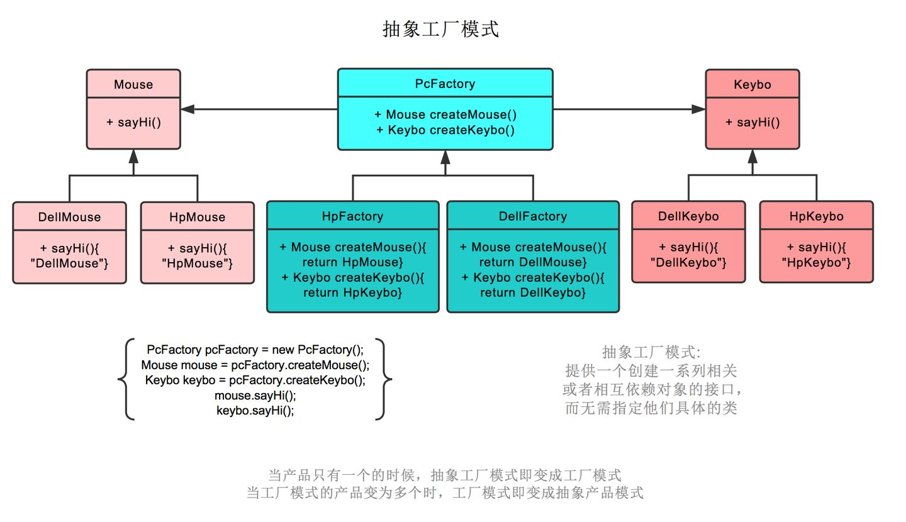
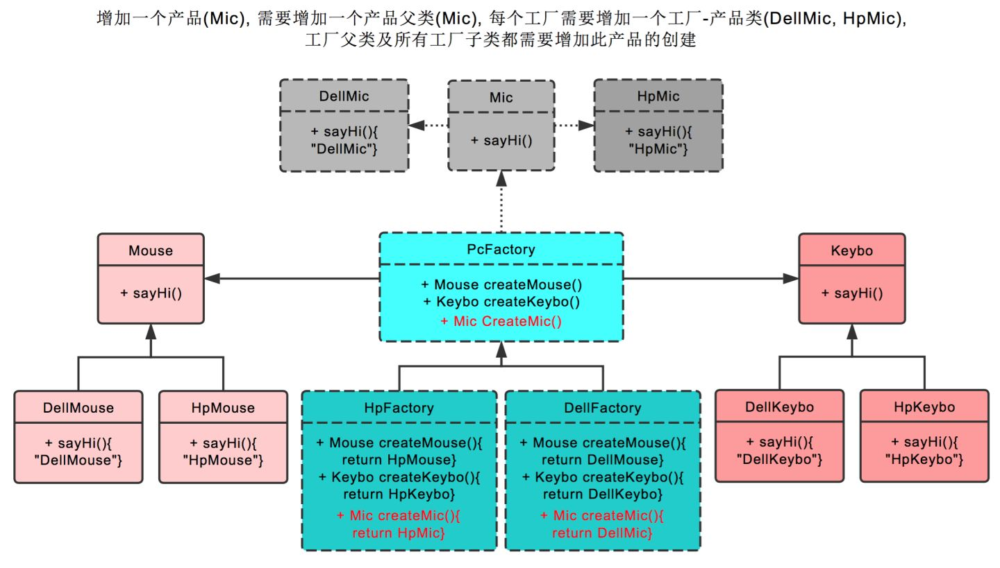

## 设计原则


## 创建型设计模式

### 单例模式

### [简单工厂模式](https://www.zhihu.com/question/20367734/answer/115807228)

简单工厂模式将“类实例化的操作”与“使用对象的操作”分开

```
简单工厂模式不是23种里的一种，通过向工厂传入不同的参数,获取不同的产品
```

**实例** 
比如下图中的鼠标工厂，专业生产鼠标，给参数0，生产戴尔鼠标，给参数1，生产惠普鼠标。  


**优缺点分析**

优点

- 将创建实例的工作与使用实例分开，使用者不必关心类对象如何创建，实现了解耦
- 把初始化实例时的工作放到工厂里进行，使代码更容易维护。

缺点

- 工厂类集中了所有实例的创建逻辑，若工厂不能正常工作，整个系统都会受到影响；
- 违背“开放 - 关闭原则”，添加新产品必须修改工厂类的逻辑
- 使用了静态工厂方法，不能被继承和重写，无法形成基于继承的等级结构


### 工厂模式

定义工厂父类负责定义创建对象的公共接口，而工厂子类则负责生成具体的对象

```
解决简单工厂需要生产新产品就需要修改工厂类的方法的缺点
```

**实例**

工厂模式也就是鼠标工厂是个父类，有生产鼠标这个接口。  

戴尔鼠标工厂，惠普鼠标工厂继承它，可以分别生产戴尔鼠标，惠普鼠标。  

生产哪种鼠标不再由参数决定，而是由实际的工厂决定。 后续直接调用鼠标工厂.生产鼠标()即可  


**优缺点分析**

优点

- 符合开放-关闭原则:新增产品只需曾加相应的工厂类,不需修改抽象工厂逻辑
- 符合单一职责原则:简单工厂类存在复杂switch逻辑判断
- 不使用静态工厂方法,可形成继承结构

缺点

- 增加新产品,需要增加新工厂类,系统开销增加
- 一个具体工厂只能创建一种具体产品,效率低

### 抽象工厂模式

抽象工厂类是负责创建一个相关对象的工厂，每个生成的工厂都能按照工厂模式提供对象

**实例**

抽象工厂模式也就是不仅生产鼠标，同时生产键盘。 
也就是PC厂商是个父类，有生产鼠标，生产键盘两个接口。 
戴尔工厂，惠普工厂继承它，可以分别生产戴尔鼠标+戴尔键盘，和惠普鼠标+惠普键盘。  
创建产品时，由戴尔工厂创建。 后续工厂.生产鼠标()则生产戴尔鼠标，工厂.生产键盘()则生产戴尔键盘。  




在抽象工厂模式中增加一个工厂

> 增加华硕工厂，则我们需要增加华硕工厂，和戴尔工厂一样，继承PC厂商。  
> 之后创建华硕鼠标，继承鼠标类。创建华硕键盘，继承键盘类。


在抽象工厂模式中增加一个产品

> 增加耳麦这个产品，则首先我们需要增加耳麦这个父类，再加上戴尔耳麦，惠普耳麦这两个子类。  
>
> 之后在PC厂商父类中，增加生产耳麦的接口。最后在戴尔工厂，惠普工厂这两个类中，分别实现生产戴尔耳麦，惠普耳麦的功能。  



**优缺点**

优点

- 解决了工厂模式的问题

缺点(无明显缺点)


### [模板模式与策略模式](https://www.jianshu.com/p/ef6c822e1c35)

#### 策略模式和模板模式的表现形式

**模板模式**

通常来说模板模式都是由抽象类来定义一个算法，在算法实现的不同步骤上抽象方法由子类继承并提供具体实现，常见的就是不同步骤提供doXXX抽象方法留给子类实现。模板模式一般有两部分组成，即抽象模板和具体模板。

**策略模式**

策略模式则是以接口形式提供抽象接口。由具体实现类提供不同算法。策略模式一般由3部分组成

- 一个Context持有所有策略实现类引用，提供给客户端运行
- 一个策略接口提供
- 具体的策略实现类

#### 策略模式和模板模式的区别

策略模式关注多种算法，模板模式关注一种算法。策略模式不同策略之间代码很少冗余。

策略模式和模板模式有一个最重要的区别，即模板模式一般只针对**一套**算法，注重对同一个算法的<font color='cornflowerblue'>不同细节</font>进行抽象提供不同的实现。而策略模式注重**多套算法多套实现**，在算法中间不应该有交集，因此算法和算法只间一般不会有冗余代码！因为不同算法之间的实现一般不会很相近。
模板模式的关注点更深,策略模式的关注点更广。而且两种模式可以一起使用，即具体某个策略下可以通过模板减少不同步骤的冗余代码。

举个简单例子，有一个玩游戏的策略类，提供一个playGame的方法，一般而言游戏可以分为Moba类、FPS类、模拟经营类、棋牌类等等，这些不同类型的游戏可以看作是不同策略，因为他们玩法大不相同。然而针对同一类型下的游戏，又可以在PC、XBox、手机甚至VR体感设备等玩耍。此时可以提供抽象类提供通用的操作方法，使用抽象方法来引导子类实现。例如Moba类游戏，不管在那个平台上都会有选人，开始游戏。而FPS类则基本打开游戏就可以直接玩。因此可以针对不同类型游戏<font color='cornflowerblue'>提供统一的父类来减少冗余代码</font>。

#### 两者是不是可以相互替换

从上一小节我们已经知道他们之间不能替换，但可以组合使用。

#### 优缺点

| 模式 | 优点                     | 缺点                                               |
| ---- | ------------------------ | -------------------------------------------------- |
| 模板 | 可维护性好，纵向扩展性好 | 耦合性较高，子类无法影响父类公用模块代码           |
| 策略 | 横向扩展性好，灵活性高   | 客户端需要知道全部策略，若策略过多会导致复杂度升高 |